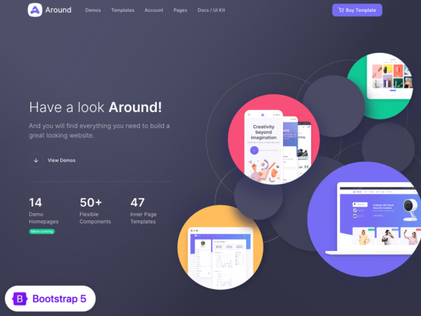
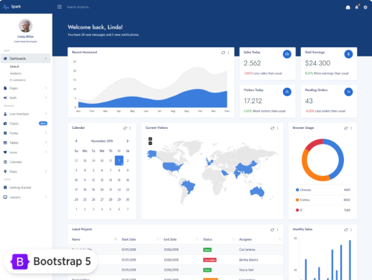

# Around theme

### Colors
    Background:
        - #323347
        - #334
        - darkslategray
        - hsl(237,17%,23%)
        - rgb(50,51,71)

    Red:
        - #f84f78
        - #f58salmon
        - hsl(345,92%,64%)
        - rgb(248,79,120)

    Green: 
        - #ffbd5d
        - #fc6sandybrown
        - hsl(35,100%,68%) 
        - rgb(255,189,93)

    Yellow:
        - #ffbd5d
        - #fc6sandybrown
        - hsl(35,100%,68%) 
        - rgb(255,189,93)

    Purple - blue:
        - #776df4
        - #77fmediumslat
        - ebluehsl(244,85% ,69%)
        - rgb(119,109,244)

# Spark theme

### Colors
    Background (white - bg):
        - #f1f4f9#fffwhitesmokehsl(217,40%,96%)rgb(241,244,249)

    Dark blue:
        - #153d77
        - #147
        - midnightblue
        - hsl(215,70%,27%)
        - rgb(21,61,119)

    Blue: 
        - #3b7ddd
        - #48e
        - royalblue
        - hsl(215,70%,54%)
        - rgb(59,125,221)

    Red:
        - #dc3545
        - #e34
        - crimson
        - hsl(354,70%,53%)
        - rgb(220,53,69)

    Green: 
     
        - #28a745
        - #3a4
        - seagreen
        - hsl(133,61%,40%)
        - rgb(40,167,69)

    Orange:
    
        - #fd7e14
        - #f81
        - darkorange
        - hsl(27,98%,53%)
        - rgb(253,126,20)
    